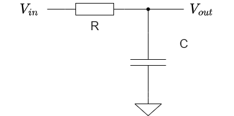
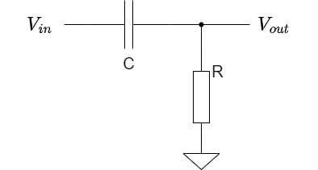
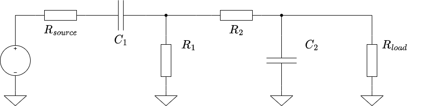
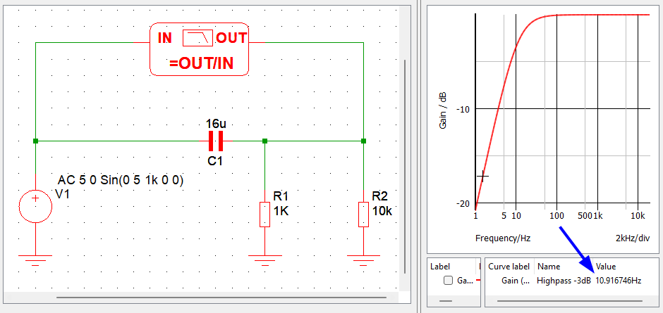
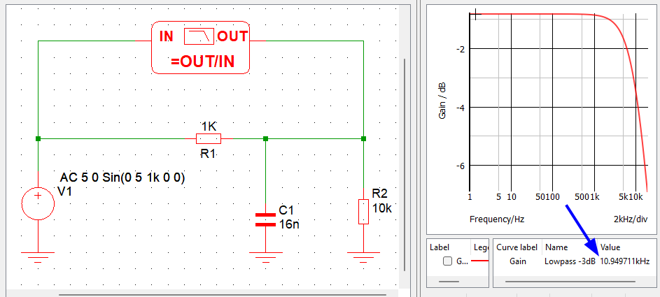
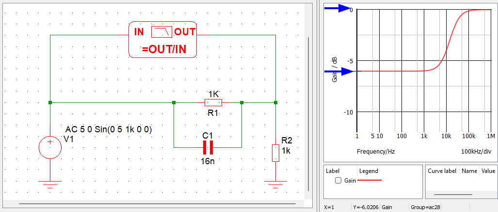

* Thevenin trick to get output/input impedance
* Capacitor = frequency dependant resistor (disregarding phase shift!)

## 1.7 Impedance and Reactance
### 1.7.1 Frequency analysis of reactive circuits

#### A. RC lowpass filter (approximate)
\ 

{#fig:rclowpass width=50%}

$$
\frac{V_{out}}{V_{in}} \approx \frac{X_C}{R + X_C} = \frac{1}{1 + \omega R C}
$$

#### B. RC highpass filter (approximate)
\ 

{#fig:rchighpass width=50%}

$$
\frac{V_{out}}{V_{in}} \approx \frac{R}{R + X_C} = \frac{\omega R C}{1 + \omega R C}
$$

#### C. Blocking capacitor
\ 

{#fig:rcblocking width=50%}

For a pulse of duration T to not be distorted while going through the blocking
capacitor:

Choose R to fit the pre-amp's output resistance and amplifier's input
resistance, then choose C so that $RC \gg T$

#### D. Driving and loading RC filters
\ 

{#fig:rccascade width=100%}

For this configuration with a desired highpass filter of cutoff frequency $f_1$
and lowpass of cutoff frequency $f_2$:

1. Determine $R_{source}$
1. Set $R_1 \ge 10 \cdot R_{source}$
1. Set $R_2 \ge 10 \cdot R_1$
1. It gives $R_{load} \ge 10 \cdot R_2$
1. Calculate $C_1 = \frac{1}{2\pi \cdot f_1 \cdot R_1}$
1. Calculate $C_2 = \frac{1}{2\pi \cdot f_2 \cdot R_2}$
1. Adjust $C_1$ and $C_2$ empirically if the accuracy is not already good enough

##### Examples
\ 

Here are two examples of a 100 Hz - 10 kHz bandpass design with two different
source resistances:

{#fig:rccascade-100 width=100%}

{#fig:rccascade-5 width=100%}

### 1.7.10 RC differentiators and integrators in the frequency domain

A differentiator (time domain) is the same circuit as a highpass (frequency
domain) and for it to work, the condition is $RC \ll 1/\omega$ with $\omega$
being the pulsation associated with the highest source frequency.

Same goes for integrator and lowpass: the condition is then $RC \gg 1/\omega$
with $\omega$ being the pulsation associated with the lowest source frequency.

# Exercise 1.37

* $V_{th} = 5~V$ because of the 1/2 voltage divider
* Shutting down $V_{th}$ gives $R_{th} = 5~k\Omega$ by equivalent resistance
* $I_N = V_{th} / R_{th} = 1~mA$

When loaded by a 5k resistor, the original circuit gives

$$
V_{out} = 10 \cdot \frac{(10k \parallel 5k)}{(10k \parallel 5k) + 10k} = 2.5~V
$$

And the Norton equivalent gives $$V_{out} = (5k \parallel 5k) \cdot 0.001 = 2.5~V$

# Exercise 1.38

* $V_{th} = 10~k\Omega \cdot 500~\mu A = 5~V$
* $R_{th} = 10~k\Omega$

# Exercise 1.39

* It's a 10 Hz highpass filter: with zero source impedance let's choose $R =
\frac{R_{load}}{10}=1~k\Omega$
* $C=\frac{1}{2\pi \cdot f \cdot R}=16~ \mu F$
* Closest standard values : 15µ and 18µ

{#fig:ex1.39 width=100%}

# Exercise 1.40

* It's a 10 kHz lowpass filter : same conditions so same $R=1~k\Omega$
* $C=\frac{1}{2\pi \cdot f \cdot R}= 15.9 nF$
* Closest standard values : 15n and 18n

{#fig:ex1.40 width=100%}

# Exercise 1.41

To have a gain of 0.5/-6 dB at DC, we need to expose a 1/2 voltage divider, and
then a highpass for the rest of the spectrum.

{#fig:ex1.41 width=100%}

# Exercise 1.42

See 1.7.1.D