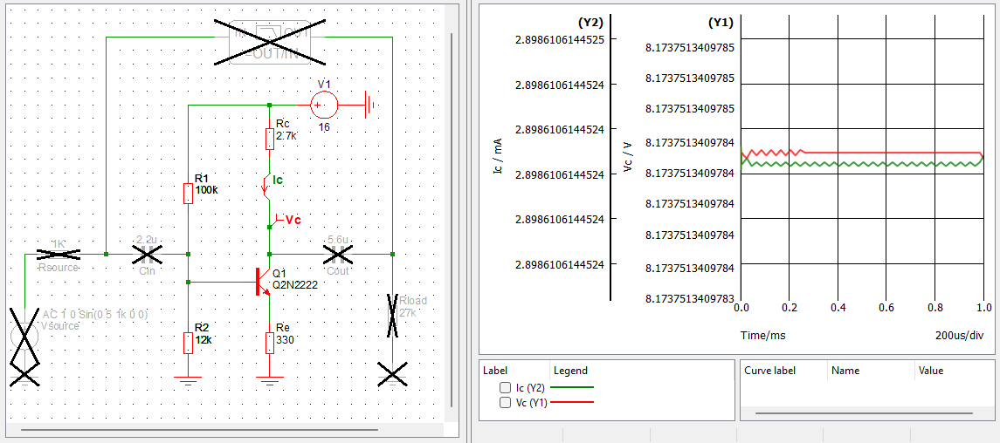
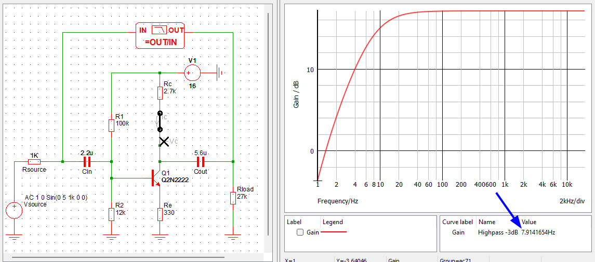

# Exercise 2.2

Charging from -4.4 V to +5 V :

$$
V_{B_{Q_2}} = (5 - (-4.4)) \cdot e^{-t/\tau} + (-4.4)
= 9.4 \cdot e^{-t/\tau} - 4.4
$$

The pulse ends when Q2 turns on again, so when $V_{B_{Q_2}} = 0.6~V$:

$$
0.6 = 9.4 \cdot e^{-t/\tau} - 4.4
$$
$$
t = -\tau \cdot ln(1-\frac{5}{9.4}) = -0.76 \cdot \tau
$$

# 2.2.3 Emitter follower

{#fig:2.14 width=50%}

It's a unity-gain amplifier : it allows to present high input impedance and low output
impedance.

* Output resistance : $R_{out} = R \parallel R_{load} \approx R$ car $R \gg R_{load}$
* Input resistance : $R_{in} = (\beta + 1)R$ with $\beta$ being the current
  gain of Q.
* Can be generalized with
$$ Z_{in} = (\beta + 1) Z_{load} $$
$$ Z_{out} = \frac{Z_{source}}{\beta + 1} $$

## Exercise 2.5

* In a follower $V_{in} = V_{out}$, so since we want 5 V at the output, we must
  divide the 15 V supply by 3 at the input, so with a 1/3 voltage divider. To
  compensate for the $V_{BE}$ voltage drop, a diode can be added to the lower
  leg of the divider.
* For a 25 mA current load, the load resistance will be $R_{load} = V_{out} /
  I_{load} = 5 / (25\mathrm{e}{-3}) = 200 \Omega$
* This gives an input impedance of $R_{in} = (\beta + 1) R_{load}$
* If the transistor is a 2N2222, for that collector current $\beta \approx 40$
  minimum so the input impedance will be at least $R_{in} = 8200 \Omega$
* The voltage divider must therefore present an output impedance of no more than
  $R_{in}/10 = 820 \Omega$

We therefore have the following system:

$$
\begin{cases}
    \frac{R_1}{R_1 + R_2} = \frac{1}{3} \\
    \frac{R_1 R_2}{R_1 + R_2} \le 820
\end{cases} \\
$$

By choosing $R_1 = 1~k\Omega$ and $R_2 = 2~k\Omega$ we get the correct divider
ratio as well as an output impedance of $666 \Omega$, which is appropriate for
this circuit. Verification:

{#fig:ex2.5 width=100%}

*Note: $R_{load} = 190\Omega$ in the simulation because the diode's voltage drop
is a bit off compared to $V_{BE}$*

At 25 mA of load current the output voltage drops just above 4.75 V which is 95%
of the targeted 5 V.

# 2.2.7 Common-emitter amplifier (1st version)

{#fig:ce01 width=60%}

1. Define power supply voltage $V_{CC}$
1. Define quiescent current $I_C$ (1 mA is a good rule of thumb)
1. Determine $R_C = \frac{V_{CC}/2}{I_C}$ to get the collector voltage to half
   the supply
1. Set $V_{E}$ at least at 1 V (at least more than $V_{BE} = 0.6~V$) with $R_E =
   \frac{V_E}{I_C}$
1. Determine the input voltage divider ($R_1$ and $R_2$) to set $V_{B} = V_{E} + 0.6$
1. Determine the input blocking capacitor with $C_{in} = \frac{1}{2\pi \cdot f
   \cdot R_{in}}$ with $f$ being the desired
   highpass frequency and $R_{in} = R_1 \parallel R_2 \parallel \beta R_E$
   being the input resistance of the circuit (with $\beta = 100$ as a rule of thumb)
1. Determine the output blocking capacitor with $C_{out} = \frac{1}{2\pi \cdot f
   \cdot R_{out}}$ with f being the same highpass frequency and $R_{out} = R_C$
   being the output resistance of the circuit

## Example

### Specifications

For a power supply of 16 V, a target quiescent current of 3 mA and a highpass
cutoff frequency of 10 Hz:

1. $$V_{CC} = 16~V$$
1. $$I_C = 3~mA$$
1. $$R_C = \frac{V_{CC}/2}{I_C} = \frac{8}{3\mathrm{e}{-3}} = 2666~\Omega$$
    * Closest E12 value: $R_C = 2700~\Omega$
1. $$R_E = \frac{V_E}{I_C} = \frac{1}{3\mathrm{e}{-3}} = 333 \Omega$$
    * Closest E12 value: $R_E = 330~\Omega$
1. $$\frac{R_2}{R_1 + R_2} = \frac{V_B}{V_{CC}} = \frac{1.6}{16} = 0.1$$
    * Choosing in the E12 $k\Omega$ range: $R_1 = 100~k\Omega$ and $R_2 =
      12~k\Omega$ gives $\frac{R_2}{R_1 + R_2} = 0.107$
1. $$R_{in} = R_1 \parallel R_2 \parallel \beta R_E = 12~k\Omega \parallel
   100~k\Omega \parallel 33~k\Omega = 8088~\Omega$$
   $$C_{in} = \frac{1}{2\pi \cdot f \cdot R_{in}} = \frac{1}{2\pi \times 10
   \times 8088} = 2~\mu F$$
    * Closest E12 value: $C_{in} = 2.2~\mu F$
1. $$C_{out} = \frac{1}{2\pi \cdot f \cdot R_{out}} = \frac{1}{2\pi \times 10
   \times 2700} = 6~\mu F$$
    * Closest E12 value: $C_{out} = 5.6~\mu F$

### Verification

{#fig:ce01-bias width=100%}

{#fig:ce01-ac width=100%}

### Shortcomings

The gain here is

$$G_{dB} = 20 \cdot \log\left(\left|\frac{-R_C}{R_E}\right|\right) = 20 \cdot
\log\left(\frac{2700}{330}\right) = 18~dB$$

It's not very high. What if we want higher gain? According to the above
equation, there are 2 solutions:

* Increase $V_{CC}$ and $R_C$: not desirable as we most of the time don't have a
choice in the supply voltage, also increasing the collector resistance will
result in an output resistance that would be impractically high
* Decrease $R_E$, or remove it entirely: yay infinite gain!

Of course, infinite gain doesn't happen, and as we'll see later a new model is
necessary to find a solution for higher gain.

# Exercise 2.24

* Base voltage is
$$V_B = V_{CC} \cdot \frac{1600}{1600+8200} = 1.63~V$$
* Emitter voltage is
$$V_E = V_B - 0.6 = 1.03~V$$
* Load current is
$$I_{load} = I_C \approx I_E = \frac{V_E}{R_E} = \frac{1.03}{1500} = 687~\mu A$$
* The output compliance is from $V_C \approx 1.13~V$ (saturation: $V_C$ just a
  tiny bit above $V_E$) to $V_C = V_{CC} = 10~V$
