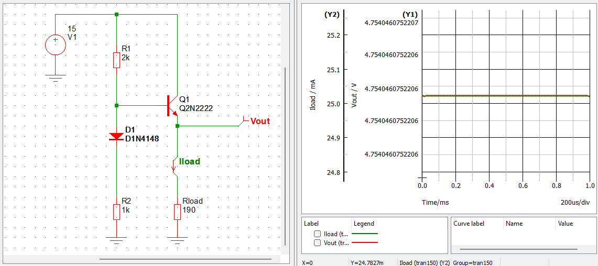

# Exercise 2.2

Charging from -4.4 V to +5 V :

$$
V_{B_{Q_2}} = (5 - (-4.4)) \cdot e^{-t/\tau} + (-4.4)
= 9.4 \cdot e^{-t/\tau} - 4.4
$$

The pulse ends when Q2 turns on again, so when $V_{B_{Q_2}} = 0.6~V$:

$$
0.6 = 9.4 \cdot e^{-t/\tau} - 4.4
$$
$$
t = -\tau \cdot ln(1-\frac{5}{9.4}) = -0.76 \cdot \tau
$$

# 2.2.3 Emitter follower

{#fig:2.14 width=50%}

It's a unity-gain amplifier : it allows to present high input impedance and low output
impedance.

* Output resistance : $R_{out} = R \parallel R_{load} \approx R$ car $R \gg R_{load}$
* Input resistance : $R_{in} = (\beta + 1)R$ with $\beta$ being the current
  gain of Q.
* Can be generalized with
$$ Z_{in} = (\beta + 1) Z_{load} $$
$$ Z_{out} = \frac{Z_{source}}{\beta + 1} $$

## Exercise 2.5

* In a follower $V_{in} = V_{out}$, so since we want 5 V at the output, we must
  divide the 15 V supply by 3 at the input, so with a 1/3 voltage divider. To
  compensate for the $V_{BE}$ voltage drop, a diode can be added to the lower
  leg of the divider.
* For a 25 mA current load, the load resistance will be $R_{load} = V_{out} /
  I_{load} = 5 / (25\mathrm{e}{-3}) = 200 \Omega$
* This gives an input impedance of $R_{in} = (\beta + 1) R_{load}$
* If the transistor is a 2N2222, for that collector current $\beta \approx 40$
  minimum so the input impedance will be at least $R_{in} = 8200 \Omega$
* The voltage divider must therefore present an output impedance of no more than
  $R_{in}/10 = 820 \Omega$

We therefore have the following system:

$$
\begin{cases}
    \frac{R_1}{R_1 + R_2} = \frac{1}{3} \\
    \frac{R_1 R_2}{R_1 + R_2} \le 820
\end{cases} \\
$$

By choosing $R_1 = 1~k\Omega$ and $R_2 = 2~k\Omega$ we get the correct divider
ratio as well as an output impedance of $666 \Omega$, which is appropriate for
this circuit. Verification:

{#fig:ex2.5 width=100%}

*Note: $R_{load} = 190\Omega$ in the simulation because the diode's voltage drop
is a bit off compared to $V_{BE}$*

At 25 mA of load current the output voltage drops just above 4.75 V which is 95%
of the targeted 5 V.